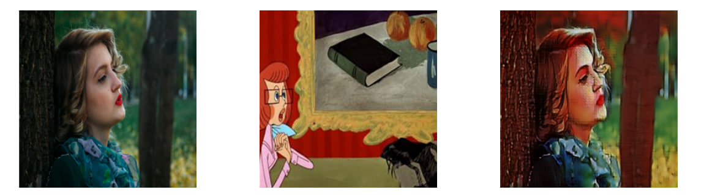
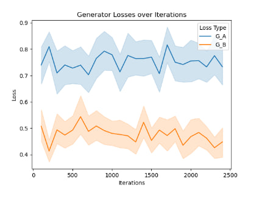
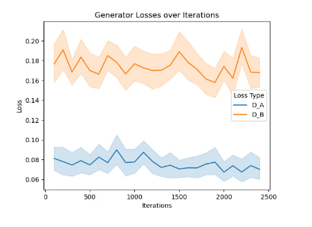

# Real-to-Cartoon Image Translation with CycleGAN

**Authors**: Sergei Fedorchenko, Aleksandr Efremov, Maxim Emelianov

This project implements an unpaired image-to-image translation pipeline using **CycleGAN**, trained to map real-world photos to the style of a chosen cartoon domain (e.g., Studio Ghibli).

---

## Formal Problem Setting

Let $X \subset \mathbb{R}^{H \times W \times 3}$ be the space of natural RGB images, and let $Y \subset \mathbb{R}^{H \times W \times 3}$ be the space of stylized cartoon images.

Given an input image $x \in X$, the goal is to learn a mapping function $G: X \rightarrow Y$ such that the generated image $\hat{y} = G(x)$ retains semantic and structural content from $x$, while adopting the visual style of $Y$.

Since paired data $(x, y)$ is unavailable, we treat this as an **unpaired image-to-image translation** task. To regularize the mapping, we introduce an inverse function $F: Y \rightarrow X$ and enforce a cycle-consistency constraint:

$$
F(G(x)) \approx x \quad \text{and} \quad G(F(y)) \approx y
$$

Both $G$ and $F$ are trained jointly using adversarial, cycle-consistency, and identity-preserving losses.

- **Category**: Unsupervised image-to-image translation  
- **Input**: $x \in X$ (real photo)  
- **Output**: $\hat{y} = G(x) \in Y$ (stylized cartoon)

---

## Evaluation Protocol

### Dataset and Preprocessing

- **Domain A (Real-world)**: 1000 photos from COCO and Unsplash
- **Domain B (Cartoon)**: 400 Prostokvashino frames extracted via `ffmpeg`
- Images resized to $256 \times 256$ and normalized to $[-1, 1]$

**Split**:
- 80% training  
- 10% validation  
- 10% test (via clustering-based stratification)

### Evaluation Metrics

- **Fréchet Inception Distance (FID)**: Measures similarity between distributions of generated images and cartoon data.
- **Optional human study**: Rating on style, realism, and content preservation.

---

## Models

- **CycleGAN**: Adversarial training with cycle-consistency
- **Transformer-based Encoders**: Cross-domain attention (e.g., StyleFormer)

---

## Statistical Baseline

### Color Histogram Matching

A statistical baseline that adjusts the RGB channel statistics of real images to match those of the cartoon domain:

$$
\hat{x}_i = \sigma_Y \left( \frac{x_i - \mu_X}{\sigma_X} \right) + \mu_Y
$$

- **Pros**: Simple, fast
- **Cons**: Does not change texture or structure
---
## Our Contribution
### Losses Adjustment

We enhanced the original CycleGAN loss function by incorporating some other parts. This encourages the generator to preserve semantic and textural similarity in the high-level feature space, leading to sharper and more realistic results. The perceptual loss was weighted carefully to avoid overpowering the cycle and adversarial components.

### Dataset Preprocessing
We manually filtered the training dataset to remove non-character and irrelevant images that could introduce noise into the model's learning. This improved the consistency and domain alignment between source and target distributions, helping the model focus on meaningful semantic transformations.
Model Choice

### Model Choice
We conducted an extensive comparative study of several image-to-image translation architectures, including Pix2Pix and attention-augmented variants of CycleGAN. Through empirical evaluation of already acquired results, we found that classic CycleGAN offered the best trade-off between training stability, simplicity, and controllability for our task. This informed our decision to retain CycleGAN with the ResNet as the backbone, while focusing our improvements on loss design and data refinement rather than structural overhauls.

## Results

### Qualitative Examples

### Quantitative Metrics

- **FID**: Lower = more realistic cartoon style
  We received
  386 - starting dataset
  300 - naive color transfer
  238 - resnet9
  200 - resnet9 with loss adjustements 

### Training Loss Curves

## Challenges

- Not enough GPU and time to train big transformers
- Limited capabilities of GAN's
- Lack of photos redrawn in a cartoon style to train entity-to-entity

---

